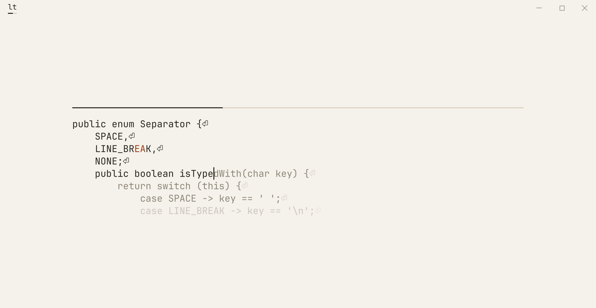
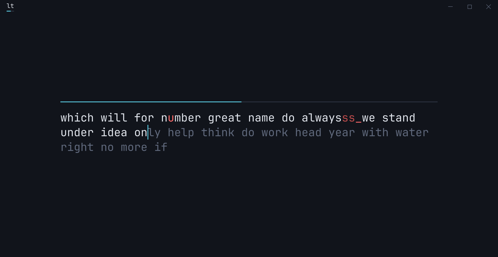
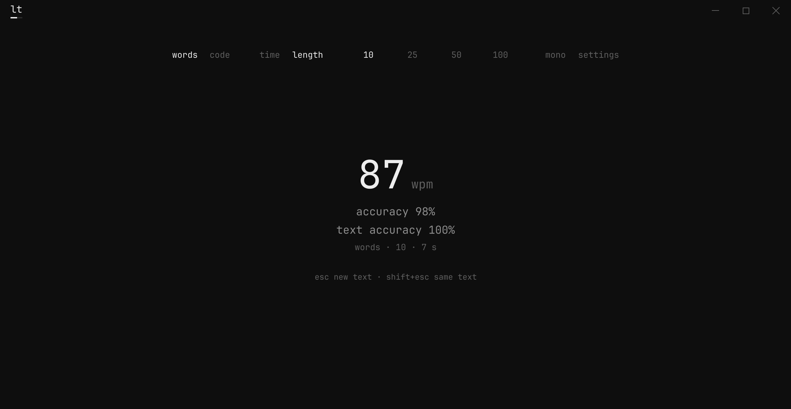

<!--suppress HtmlDeprecatedAttribute, CheckImageSize: GitHub strips CSS from a README, so align is the only
    way to centre, and the screenshots are shown smaller than they are on purpose. -->

# lite-type

<p align="center">
  
</p>

A typing test for the desktop, with real code to practise on as well as words. The name is the brief, in two senses:
lite as in minimal, in features, dependencies, and look, and light as in never heavy or slow.

<p align="center">
  
</p>

lite-type runs on Windows and Linux with nothing else to install: see [Download](#download).

## Why

I'd wanted to try JavaFX for a long time, but never had a good excuse to. I'd also been working on my typing, on various
websites, to make my everyday work faster. A typing test, built as a desktop app in JavaFX, was the perfect way to do
both.

## Features

- **Words and code:** random words from a list of 200 common English words, or 12 Java snippets, short, medium, or
  long, typed line by line.
- **Two modes:** Timed, for 15, 30, 60, or 120 seconds of text that keeps coming, or Length, for 10, 25, 50, or 100
  words, or one whole snippet.
- **Typed straight into the text:** there's no input box. Each letter fills in when you type it right and turns red
  when you don't, and nothing ever stops you.
- **Three scores:** WPM, accuracy, and text accuracy. See [Scoring](#scoring).
- **Three themes:** Ink, warm paper and ink, the default; Night, cool blue-black; and Mono, black and white, with red
  only for mistakes.
- **Fits any window:** by default the text grows and shrinks with the window, keeping a full line of code across, or it
  stays at one of four fixed sizes. The choices, the theme, and the window's size and place are remembered.
- **Light:** the app's own work for each key takes 0.035 to 0.061 ms at the median, measured on Windows and on Linux.
  Nothing is read from disk while you type.
- **Packages for Windows and Linux**, each carrying its own Java runtime.
- **138 unit tests.**

## Download

The [latest release](https://github.com/noahparknguyen/lite-type/releases/latest) has these files:

| File                               | What it is                                                |
|------------------------------------|-----------------------------------------------------------|
| `lite-type-1.0.0-windows-x64.exe`  | The Windows installer                                     |
| `lite-type-1.0.0-windows-x64.zip`  | Windows, portable: runs from any folder                   |
| `lite-type-1.0.0-linux-x64.deb`    | The package for Ubuntu 22.04 or later, Debian 12 or later |
| `lite-type-1.0.0-linux-x64.tar.gz` | Linux, portable: runs from any folder                     |
| `SHA256SUMS`                       | Every file's checksum, for checking a download            |

Each package carries its own Java runtime, JavaFX included, so there's nothing else to install.

### Installing and removing

**The Windows installer.** Run it. lite-type isn't signed with a code-signing certificate, so Windows may first say
"Windows protected your PC": choose **More info**, then **Run anyway**. It installs for you alone, without administrator
rights, into `%LOCALAPPDATA%\lite-type`, and offers a Start menu entry and a desktop shortcut. A newer version's
installer replaces the older version.

To remove it, open **Settings → Apps → Installed apps** (**Apps & features** on Windows 10) and uninstall lite-type.
That removes everything it installed, but not your settings: see below.

**The Windows zip.** Unzip it anywhere and run `lite-type\lite-type.exe`. Windows may warn the same way. To remove it,
delete the folder.

**The `.deb`.** From the folder with the download:

```
sudo apt install ./lite-type-1.0.0-linux-x64.deb
```

lite-type then appears in the desktop's menu under Education, and `/opt/lite-type/bin/lite-type` runs it from a
terminal. To remove it:

```
sudo apt purge lite-type
```

**The `.tar.gz`.** Unpack it anywhere and run `lite-type/bin/lite-type`. To remove it, delete the folder.

**Your settings.** lite-type saves your choices, theme, and window's size and place, through Java's own settings store.
Removing the app leaves them, so a reinstall opens where you left off. To remove them too, on Windows, in PowerShell:

```
Remove-Item -Recurse HKCU:\Software\JavaSoft\Prefs\dev\noahpn
```

On Linux:

```
rm -r ~/.java/.userPrefs/dev/noahpn
```

### Checking a download

`SHA256SUMS` lists the SHA-256 checksum of every file in the release. On Linux, from the folder with the downloads:

```
sha256sum --check --ignore-missing SHA256SUMS
```

On Windows, in PowerShell, compare what this prints with the file's line in `SHA256SUMS`:

```
Get-FileHash lite-type-1.0.0-windows-x64.exe
```

Every file also has a signed attestation of the workflow that built it and the commit it was built from. The
[GitHub CLI](https://cli.github.com/) checks it, here for the release workflow alone:

```
gh attestation verify lite-type-1.0.0-windows-x64.exe --repo noahparknguyen/lite-type --signer-workflow noahparknguyen/lite-type/.github/workflows/release.yml
```

Releases are immutable: once published, their files can't be changed or replaced.

## Build

Java 25 is all it takes. The Maven Wrapper downloads Maven 3.10.0 the first time, and checks it against its checksum.
From the root of the repo:

```
./mvnw package
```

On Windows, `.\mvnw.cmd package`. This runs the tests, then writes the two jars, `core/target/lite-type-core-1.0.0.jar`
and `app/target/lite-type-app-1.0.0.jar`. A failing test means no jars. To run the app from the build:

```
./mvnw -pl app -am javafx:run
```

After `./mvnw package`, `bash app/packaging/package.sh` builds the packages for the system it runs on, into
`app/target/packages`. It downloads JavaFX's modules from Gluon and checks them against the checksums pinned in the
script. On Windows it needs Git Bash and WiX 3.

## Using it

The bar at the top picks what to type (words or code), the mode (time or length), and how long. Picking anything starts
a new run, and the clock starts on your first key, so reading the first word costs nothing. While you type, the bar
fades and the progress shows above the text, as a line by default. The last two entries open the theme page and the
settings page: text size, and whether the progress is a line or a number.

### Keys

| Key            | What it does                                                         |
|----------------|----------------------------------------------------------------------|
| Escape         | New text: a fresh run, with the same choices                         |
| Shift+Escape   | The same text again                                                  |
| Backspace      | Takes back one character, into the word before if this one is empty  |
| Ctrl+Backspace | Clears the word, or the word before when this one is empty           |
| Enter          | Ends a line of code, and in words counts as a wrong key              |
| Tab            | Nothing                                                              |

### How the cursor moves

**Words move by word.** Space ends a word and jumps to the next. Letters you skip are marked missed, and the early Space
counts as one wrong key. Letters typed past a word's end show in red after it, and the Space after them counts as one
wrong key too. So one slip stays one mistake, instead of shifting every letter after it.

<p align="center">
  
</p>

**Code moves by character.** Every key fills the next position, right or wrong, so a line never changes shape and each
red character takes one Backspace to fix. Indentation is shown but skipped: after Enter, the cursor jumps past it.
Every bracket is typed, and nothing closes itself.

### Scoring

- **WPM:** characters in fully correct words, plus the space after each, divided by 5, per minute. A word with a mistake
  left in earns nothing, so fixing a mistake always scores better than leaving it.
- **Accuracy:** correct keys out of every key pressed, Backspace aside. A mistake you fixed still counts, since the
  wrong key was pressed.
- **Text accuracy:** how much of the text you reached ended up right. Fixed mistakes don't count, so fixing everything
  gives 100%.

Accuracies round down, so 100% only ever means perfect.

<p align="center">
  
</p>

## Tests

```
./mvnw test
```

On every push to `main` and every pull request, GitHub Actions runs the tests on Linux. On every push to `main`, it also
builds the packages on Windows and on Linux, running the tests on each.

`TypingMeasurement` times the app's share of each key, with a scripted typist going through every kind of mistake. It
opens a window, so it isn't part of a normal build:

```
./mvnw -pl app -am test -Dtest=TypingMeasurement -Dsurefire.failIfNoSpecifiedTests=false
```

## Limits

- **No macOS package.** The packages are for Windows and Linux, on x64.
- **Words and Java only.** Quotes, snippets in other languages, and typing your own files are planned.
- **No saved scores yet.** Each run's results are shown once, and nothing is kept between runs. Personal bests are
  planned.
- **The installer isn't signed,** so Windows warns before running it the first time.

## Credits

- [JetBrains Mono](https://github.com/JetBrains/JetBrainsMono), the font for everything, by JetBrains, under the SIL
  Open Font License 1.1. Its licence is in `licenses/`, and ships inside every package.
- [OpenJFX](https://openjfx.io/), JavaFX itself, and [Eclipse Temurin](https://adoptium.net/), the Java runtime, both
  under the GPL v2 with the Classpath Exception. Each package carries them, with their licences in the runtime's
  `legal` folder.
- [Monkeytype](https://github.com/monkeytypegame/monkeytype), whose word-by-word typing lite-type follows. No code or
  word lists come from it: the word list and the snippets were written for lite-type.

## Licence

MIT. See [`LICENSE`](LICENSE).
